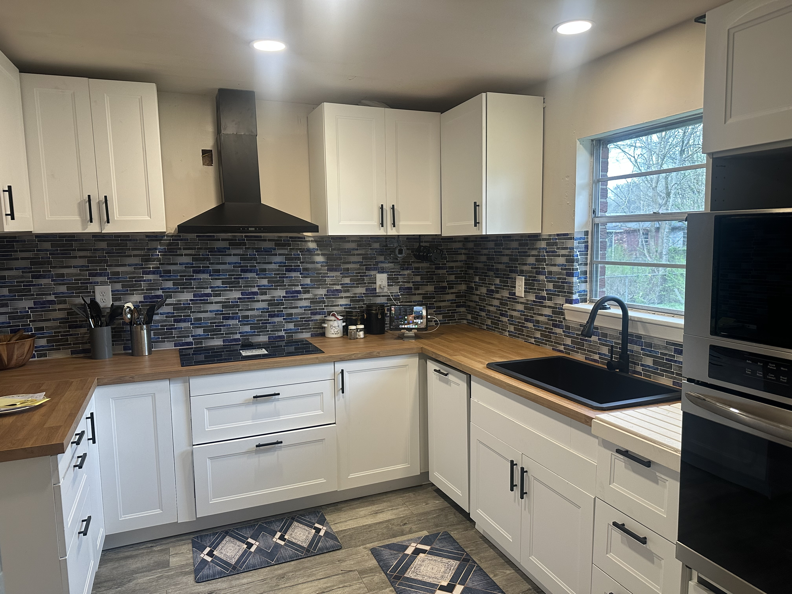
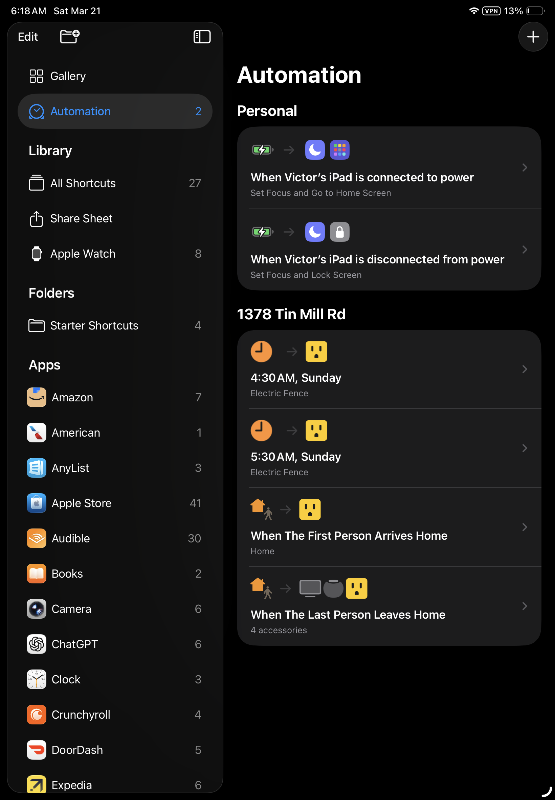

# Apple Home (Front-End Control Layer)

## Overview

Apple Home serves as the **primary user interface and control layer** for the smart home system.

It provides:
- a clean, intuitive dashboard for all devices
- secure remote access through Apple’s ecosystem
- real-time presence detection using iPhones
- voice control through Siri and HomePods
- household-wide notifications and automation feedback

In this architecture:

> **Apple Home handles people, interaction, and communication**  
> **Home Assistant handles logic, automation, and system control**

---

## Interface Preview

### Apple Home Dashboard (Control Layer)

### Device & Sensor View (Data Layer)

### Automation System (Logic Trigger Layer)

### iPad Kiosk Interface (Shared Control Terminal)

### Home Access & Permissions (User Management)

---

## Core Responsibilities

Apple Home is responsible for all **human interaction with the system**:

- device control (lights, climate, switches)
- room-based organization
- automation triggers based on presence
- notifications and voice feedback
- remote access via Apple Home hubs (HomePod / Apple TV)

This ensures the system remains:
- simple for family use
- consistent across devices
- secure without exposing internal infrastructure

---

## Presence Detection (iPhone-Based)

Apple Home uses **native iPhone location tracking** to determine:

- when the first person arrives home
- when the last person leaves
- occupancy state of the home

### Why This Matters

- extremely reliable geofencing (Apple-level precision)
- no additional apps or trackers required
- fully encrypted and privacy-focused
- updates instantly across the Home ecosystem

---

## Security & Privacy Model

Apple Home provides a **secure external interface** without exposing internal systems.

- all remote access is handled through Apple’s infrastructure
- end-to-end encryption is used for device communication
- no direct inbound access to the home network is required
- Home Assistant remains local-only and protected

---

HomePod Role (Home Hub)

HomePod devices act as the active Apple Home Hub for the system.

They are responsible for:

	•	executing Apple Home automations
  
	•	handling Siri voice interaction
  
	•	maintaining real-time Home state
  
	•	enabling secure remote access

The HomePod operates as the automation and communication backbone of Apple Home, while devices like the iPad and iPhone serve only as control interfaces.

---
## Eufy Security Integration (Home / Away Modes)

Apple Home presence directly controls the behavior of the **Eufy security system**.

### Behavior

- **When Home**
  - cameras reduce alerts or switch to home mode
  - prevents unnecessary notifications for family movement

- **When Away**
  - cameras switch to full monitoring mode
  - motion detection and alerts are fully enabled

### Result

- automated security without manual toggling
- reduced false alerts
- seamless transition between states

---

## Siri Voice & Notification System

Apple Home acts as the **communication layer** for the smart home.

Using HomePods and Siri:

### Notifications Include

- dishwasher allowed to run during low-cost energy windows
- washer and dryer completion alerts
- system status updates and alerts
- presence-based announcements

### Example Outputs

> “Dishwasher is now running during off-peak hours.”  
> “Laundry is complete.”  
> “Energy-saving mode is active.”

---

## Automation Role in the System

Apple Home handles:

- presence-based automations
- simple time-based triggers
- user-facing logic and scenes

It does **not handle heavy automation logic**.

Instead:
- it reacts to events
- communicates outcomes
- provides user control

---

## iPad Kiosk Integration

Apple Home is extended through an **iPad kiosk interface**, which serves as a shared home control terminal.

### Behavior

- always-on when docked
- restricted interface for household use
- instant access to:
  - climate
  - lighting
  - device control
  - system status

### Purpose

- provides a centralized control point
- eliminates dependency on personal devices
- enhances accessibility for all users

---

## System Philosophy

This setup separates responsibilities cleanly:

- **Apple Home = interface, presence, communication**
- **Home Assistant = automation, optimization, control**

### Result

- reliable and stable system behavior
- minimal complexity for users
- powerful backend automation without exposure
- seamless integration across devices

---

## Final State

- users interact through Apple Home
- presence detection drives automation behavior
- Siri communicates system events
- security systems adjust automatically
- the home responds intelligently without manual input

---
## Presence-Based Climate Influence

Apple Home presence detection also plays a key role in **climate behavior**, acting as the front-end trigger for HVAC decisions.

### Behavior

- **When someone arrives home**
  - Apple Home updates occupancy instantly
  - this state is passed into the system
  - climate recovery logic becomes eligible to run

- **When the home is empty**
  - unnecessary cooling is avoided
  - recovery routines are delayed or skipped
  - energy usage is reduced automatically

---

### Why This Matters

- prevents cooling empty rooms  
- improves comfort timing (cooling happens when it matters)  
- works seamlessly with Apple’s highly accurate geofencing  
- requires no additional apps or sensors on the user side  

---

### System Role

Apple Home does not control temperature directly.

Instead, it acts as the **presence authority**:

- determines *who is home*
- signals *when comfort is needed*
- enables or suppresses deeper HVAC logic

---
Why Apple Home

Apple Home was chosen as the front-end layer because it provides the best balance of security, reliability, and user experience for a household-facing system.
- Secure by design
- all remote access is handled through Apple infrastructure
- end-to-end encryption with no need to expose internal services
- Best-in-class presence detection
- native iPhone geofencing is fast, accurate, and requires no additional apps
- shared seamlessly across all household members with apple devices
- Clean, consistent interface
- simple for non-technical users
- identical experience across iPhone, iPad, and HomePod

Compared to Google Home

	•	more cloud-dependent for automation logic
	•	less control over keeping systems fully local
	•	less consistent UI across devices

---
### Result

- climate feels responsive to real life, not just schedules  
- energy usage is reduced without sacrificing comfort  
- the system adapts naturally to daily routines
- Apple Home provides a secure, polished, and family-friendly interface, while Home Assistant maintains full local control and automation power behind the scenes.

## Status

Production-ready and actively used.
