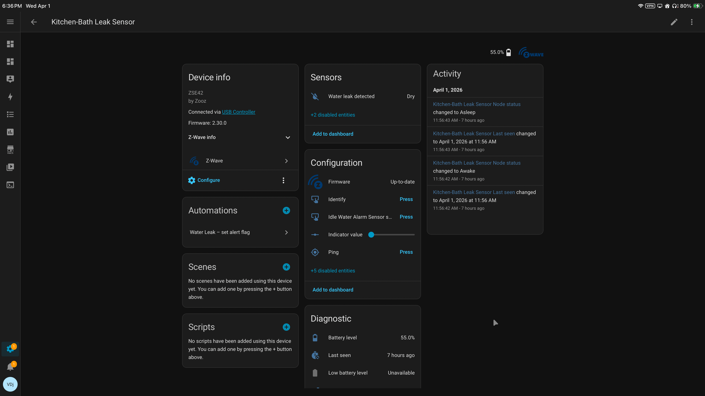
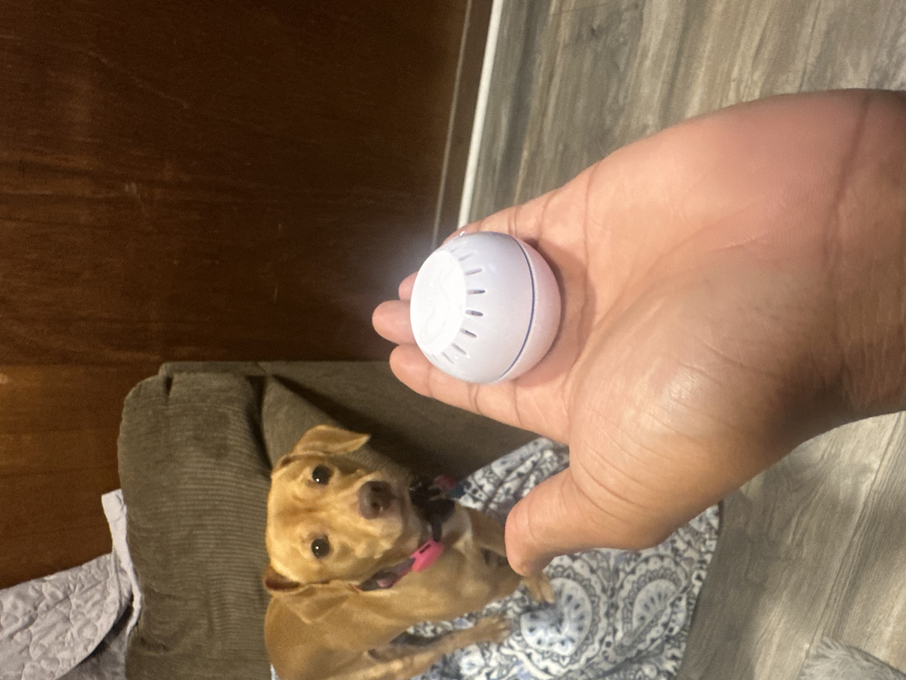
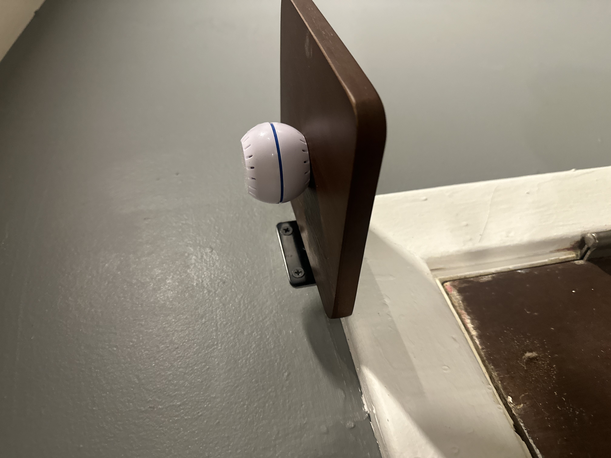

# Layer 0 — Safety Protection System

The Safety Layer is the highest-priority system in the Home Assistant architecture.

It operates independently of all other automation logic and is never overridden.

---

## Purpose

Prevent damage, unsafe conditions, and environmental risks by enforcing non-negotiable rules at all times.

This layer exists to protect:

- the structure of the home  
- critical infrastructure (water, HVAC)  
- and living conditions for occupants and pets  

---

## Core Principles

- Always active  
- Overrides all other layers  
- Stateless enforcement (no reliance on schedules or presence)  
- Immediate response to unsafe conditions  

---

## Physical Sensor Layer

### Leak Detection — Wet Wall Placement

  

A Z-Wave leak sensor is installed **inside the wet wall beneath the bathtub**.

This placement is intentional:

- detects leaks at the earliest possible point (inside the wall, not after water escapes)  
- protects against hidden plumbing failures  
- minimizes structural damage risk  

### Behavior

- Sensor state change → immediate trigger  
- Home Assistant raises a critical event  
- Apple Home delivers a **real-time user-facing alert**

> The goal is to detect water **before it becomes visible damage**.

---

### Temperature Sensors — Physical Size Reference

  
  

Shelly Wave H&T sensors are used for environmental monitoring.

Key characteristics:

- compact, low-profile deployment  
- Z-Wave communication (low power, high reliability)  
- suitable for distributed placement throughout the home  

These sensors form the backbone of:

- freeze protection  
- temperature safety thresholds  
- environmental awareness  

---

## Protections Implemented

### Dog Environment Safety (Baseline HVAC Override)

The system enforces safe temperature ranges in the living area independent of all other logic.

#### Cooling Safety

- Fan activates if temperature ≥ 85°F for 10 minutes  
- Turns off once temperature ≤ 80°F for 10 minutes  

#### Heating Safety (Cycled Protection)

- Activates if temperature < 52°F  
- Stops if temperature > 59.5°F  

Cycle behavior:

- 2 hours ON  
- 1 hour OFF (cool-down period)  
- repeats until safe range is restored  

This prevents:

- overheating  
- excessive runtime  
- unstable temperature swings  

> This logic ignores presence, energy cost, and system mode.

---

### Laundry Room Freeze Protection (Critical Infrastructure)

Protects an exterior laundry space containing:

- water heater  
- exposed plumbing lines  

#### Activation Conditions

- Starts if temperature < 50.5°F for 10 minutes  

#### Behavior

- 2-hour heating cycles  
- 1-hour rest periods  
- maximum 8-hour protection window  

#### Safety Controls

- early shutdown if ≥ 60°F  
- automatic lockout after 8-hour cycle (10-hour cooldown)  
- failsafe cutoff if heater runs too long (restart protection)  

> Designed to prevent pipe damage during extreme cold events.

---

### Leak Detection

- Z-Wave leak sensor monitors wet wall interior  
- triggers immediate alert on state change  

Integration flow:

1. sensor detects moisture  
2. Home Assistant flags event  
3. Apple Home sends user notification  

No delay. No filtering.

---

### Extreme Temperature Safeguards

- prevents unsafe indoor environmental conditions  
- ensures minimum viable living range is maintained  

---

### Power Recovery Logic

- restores system to safe operational state after outages  
- prevents devices from returning in unsafe or undefined states  

---

## System Behavior

This layer operates without regard to:

- energy cost  
- occupancy  
- schedules  
- automation mode  

> Safety is enforced unconditionally.

---

## Device Dependencies

- Z-Wave leak sensors  
- Shelly Wave H&T temperature sensors  
- smart plugs (Kasa / controlled loads)  
- HVAC control entities  

---

## Design Role

This layer forms the **foundation of the entire system**.

All other automation layers:

- depend on it  
- inherit from it  
- and must respect its decisions  

Failure of this layer is not acceptable.

---

## Implementation Reference

The automations in this folder define:

- temperature threshold enforcement  
- cycling logic for heating systems  
- freeze prevention safeguards  
- safety-triggered device control  

These are implemented directly in Home Assistant using:

- numeric_state triggers  
- timers for controlled cycling  
- restart-safe state tracking  
- strict condition enforcement  

---

## Design Philosophy

This is not convenience automation.

This is **environmental protection logic**.

- safety overrides efficiency  
- protection overrides comfort  
- automation exists to prevent failure  

The system does not wait for problems.

It actively prevents them.
