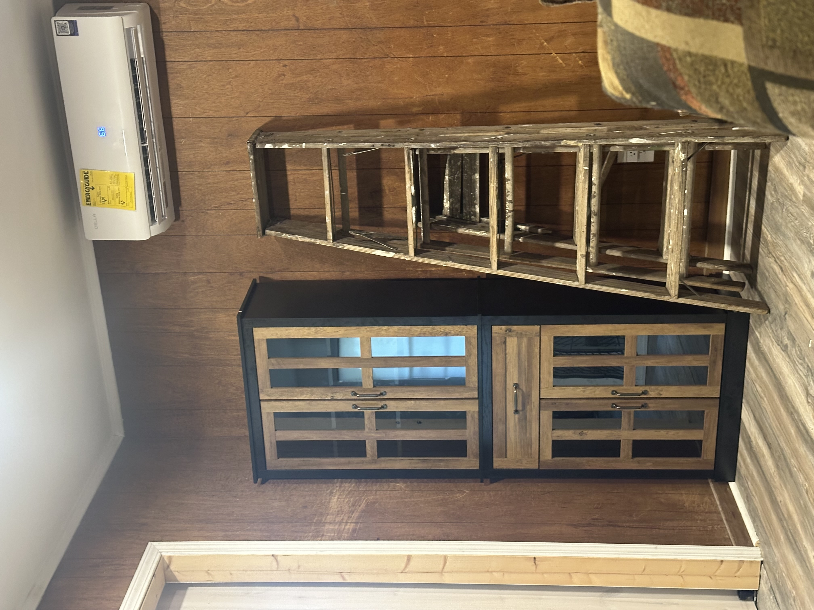
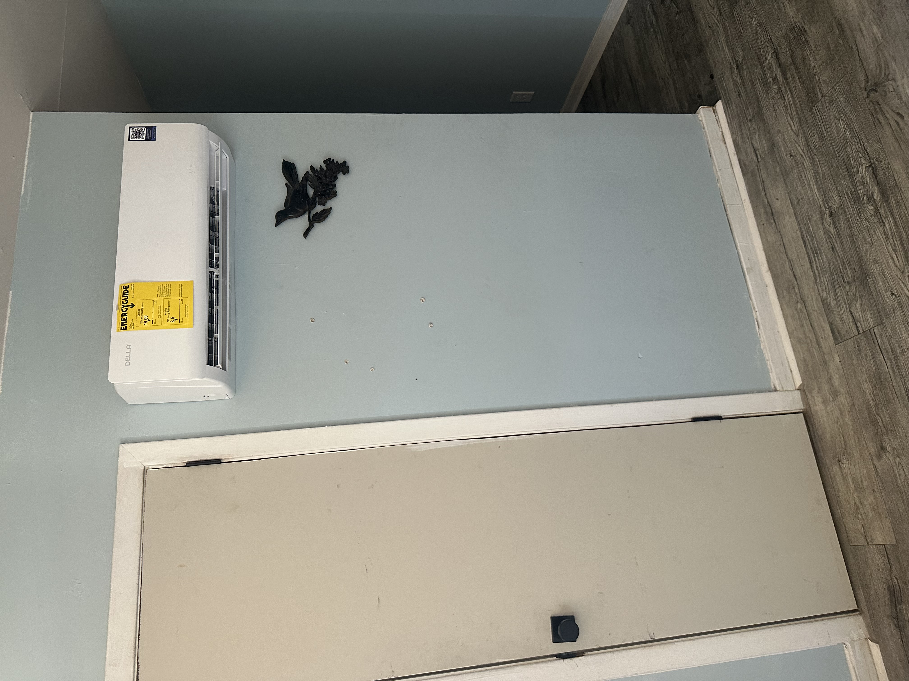

# Comfort and HVAC Control System

This folder documents the climate-control layer of the Home Assistant system.

It governs a **4-zone Della mini-split installation** using Home Assistant as the automation engine and **Tuya** as the backend integration layer.

The HVAC system is not treated as four unrelated wall units.

It is managed as a **coordinated multi-zone climate platform** with:

- baseline comfort control  
- adaptive recovery  
- occupancy-gated permission  
- live target enforcement  
- cross-zone mode compliance  

---

## Physical HVAC Platform

The home uses a **Della quad-zone mini-split heat pump system** sized for a small residential footprint.

### Installed System

- **Outdoor unit:** 35K BTU multi-zone condenser  
- **Indoor heads:** 4 total  
- **Head sizing:** 9K / 9K / 9K / 9K  
- **Efficiency rating:** **19 SEER2**  
- **Electrical service:** 208–230V  
- **Coverage class:** up to approximately **1600 sq ft**  

This system was selected for a home that is approximately **1300 sq ft**, which makes it a strong fit for:

- full-house zoned conditioning  
- improved room-by-room control  
- reduced runtime waste compared to oversized central cooling  
- better efficiency in partially occupied spaces  

### Why This System Was Chosen

This platform fit the goals of the house better than a traditional single-zone or central system because it provides:

- **true zone-level conditioning**  
- **heat pump efficiency**
- **high seasonal efficiency (19 SEER2)**  
- **room-by-room control without conditioning the entire house unnecessarily**  
- **smart integration support through Tuya / Wi-Fi connectivity**  

For a 1300 sq ft home, that matters.

Instead of pushing conditioned air across the entire house every time comfort is needed, the system can target only the spaces that actually require heating or cooling.
you gain central air-conditioning feel without the central air conditing. 

That reduces:

- unnecessary energy consumption  
- wasted runtime  
- comfort mismatch between rooms  
- over-conditioning of unused spaces  

---

## Installed Unit Examples

### Den Mini-Split

  

This image shows one of the installed Della indoor heads in the den.

The den is treated as an activity-driven zone rather than a full-time conditioned space, so this unit is used when the room is actively in use.

---

### Living Room Mini-Split

  

This image shows the living room indoor head.

The living room functions as the **baseline shared zone** and serves as the HVAC mode authority for the rest of the active zones.

---

## Zone Layout

- **Living Room / Common Area** → baseline shared zone  
- **Bedroom 1** → private sleeping zone  
- **Bedroom 2** → private sleeping zone  
- **Den** → activity-driven zone  

Each indoor head is exposed into Home Assistant through the **Tuya integration**.

### Integration View

  

This integration layer provides the control path between Home Assistant and the Della HVAC equipment.

Tuya is used as the backend device service, while Home Assistant retains control of the automation logic.

---

## Energy Efficiency Benefits

The efficiency value of this system comes from both the hardware and the automation strategy.

### Hardware Efficiency

The Della system provides:

- **19 SEER2 seasonal efficiency**
- **heat pump heating and cooling**
- **multi-zone distribution from a single outdoor system**
- **independent indoor heads for targeted runtime**

### Operational Efficiency

Home Assistant adds another layer of savings by deciding:

- which rooms are allowed to run  
- when recovery should begin  
- when a zone should remain off  
- how to prevent unnecessary overlap or mode conflicts  

This means the system saves energy in two ways:

1. **efficient HVAC hardware**
2. **smarter runtime control**

For this house, that is important because comfort demand is not uniform across all rooms.

The bedrooms, den, and living room all have different usage patterns, so the system is able to reduce waste by conditioning only the spaces that actually need it.

---

## Design Purpose

This folder exists to solve a real residential control problem:

- maintain comfort where needed  
- avoid conditioning unused rooms  
- keep all active zones in the correct operating mode  
- reduce unnecessary runtime  
- preserve predictable system behavior  

The result is a climate system that behaves like a coordinated control layer rather than a set of manually adjusted room units.

---

## Zone Roles

### Living Room — Baseline Zone and Mode Authority

The living room is the primary reference zone.

It serves two roles:

- baseline comfort for the main shared area  
- **mode authority** for the rest of the home  

When the living room is actively heating or cooling, other active zones are expected to match that mode.

This prevents conflicting behavior across heads and avoids problems caused by mixed heat/cool states.

---

### Bedrooms — Adaptive Recovery Zones

Bedroom 1 and Bedroom 2 are treated as **predictive comfort zones**.

They do not simply hold a fixed temperature all day.

Instead, they use:

- day vs night target temperatures  
- ramped transitions between day and night targets  
- learned heating and cooling rates  
- estimated minutes needed to reach target temperature  

This allows the system to begin conditioning **before comfort is needed**, rather than reacting after the room is already out of range.

The bedroom recovery system is also gated by stable occupancy state, so it does not continue conditioning when the house is away.

---

### Den — Activity-Driven Zone

The den is not scheduled like a bedroom and not treated like a baseline space.

It is activity-driven.

The zone turns on when the TV is intentionally started and remains active while the room is in use.

When activity ends:

- an idle timer begins  
- the zone remains on briefly in case activity resumes  
- the unit shuts down if the room stays inactive  

The den also mirrors the living room HVAC mode while active so that it remains aligned with the rest of the system.

---

## Occupancy Gating

HVAC runtime is not granted by temperature alone.

It is granted by **permission**.

That permission is supplied by the stable occupancy model defined elsewhere in the system.

This folder consumes:

- `binary_sensor.house_occupied_stable`

Behavior:

- when the house goes away, bedrooms and den are forced off  
- when the house returns, bedroom logic is allowed to resume  
- the living room is not blindly forced off by away logic because it functions as the baseline zone  

This makes occupancy a control boundary rather than a suggestion.

---

## Adaptive Recovery Logic

The bedroom and living room SmartRec logic uses predictive recovery rather than simple thermostatic hold behavior.

### Inputs Used

- current room temperature  
- current target temperature  
- time until next aim point  
- learned heat/cool rate  
- seasonal helper state  

### What It Does

For each zone, Home Assistant estimates:

- temperature delta from target  
- minutes needed to recover  
- when the zone should begin conditioning  

Once the estimated time needed becomes greater than or equal to the time remaining until the next target window, recovery begins.

### Learned Rate Model

Each zone tracks separate learned rates for:

- cooling  
- heating  

When a recovery cycle completes successfully, the observed performance is blended back into the stored rate.

This allows the system to gradually tune itself to the real behavior of each room.

---

## Day / Night Target Structure

The comfort layer uses **ramped target transitions** rather than abrupt temperature jumps.

### Shared Pattern

- **17:00–21:00** → ramp Day to Night  
- **05:00–09:00** → ramp Night to Day  

This avoids sudden target shifts and gives the system time to move rooms gradually toward the next comfort band.

---

## Live Target Enforcement

Once a zone is active, Home Assistant continues to enforce the intended target temperature through a live correction loop.

### Behavior

- runs periodically  
- checks current setpoint vs desired target  
- only corrects when drift is meaningful  
- avoids unnecessary command spam  

If a unit exposes low/high target fields, both values are updated.

If it exposes only a single target value, that value is maintained directly.

This keeps active zones synchronized with the automation model even if the climate entity drifts.

---

## Mode Compliance Watchdog

A separate watchdog enforces mode consistency across active zones.

### Authority

- **Living Room** = mode authority  

### Mirrors

- Bedroom 1  
- Bedroom 2  
- Den  

### Behavior

- when living room changes to `heat` or `cool`, active zones are updated  
- if a zone turns on later, it is brought into compliance  
- a periodic sweep acts as a safety net for edge cases  

This keeps the active HVAC system behaving as a single coordinated platform.

---

## Master Behavior Rules

The HVAC master layer defines the high-level rules that all HVAC automations must respect.

### Implemented Rules

- bedrooms turn off on away  
- den turns off on away  
- living room is not forced off by away logic  
- recovery flags are cleared when units are manually turned off  
- SmartRec does not fight an explicit OFF state  

Manual control is preserved.

---

## Den Activity Logic

The den logic is intentionally simple and deterministic.

### Trigger Path

1. TV wake request  
2. TV comes online  
3. Den AC turns on  
4. Idle timer is canceled while TV remains active  
5. When TV goes off, idle timer begins  
6. If inactivity continues, den AC turns off  

This creates a room-specific climate policy tied directly to actual room use.

---

## Integration and Control Philosophy

The Della mini-split hardware is cloud-backed through Tuya, but the decision-making is local to Home Assistant.

That split matters.

### Tuya Provides

- device connectivity  
- HVAC entity exposure  
- command path to the units  

### Home Assistant Provides

- zoning policy  
- occupancy gating  
- predictive recovery  
- mode arbitration  
- temperature enforcement  
- whole-home HVAC behavior  

The climate system therefore remains **automation-driven**, not app-driven.

---

## Climate Entities

- `climate.air_conditioner` → Bedroom 2  
- `climate.air_conditioner_2` → Living Room  
- `climate.air_conditioner_3` → Bedroom 1  
- `climate.air_conditioner_4` → Den  

---

## What This Folder Contains

This folder includes the automations and helpers that define:

- bedroom auto-on behavior when home returns  
- den TV-driven on/off logic  
- HVAC master away behavior  
- mode compliance watchdog logic  
- shared SmartRec helpers  
- live target enforcement  
- bedroom adaptive recovery logic  
- living room adaptive recovery logic  

Together, these files implement the comfort layer of the home.

---

## Design Summary

This is not a generic thermostat setup.

It is a **multi-zone residential HVAC orchestration layer** built on top of a high-efficiency 4-zone Della mini-split heat pump system sized appropriately for a 1300 sq ft home.

The system is designed to be:

- predictive  
- occupancy-aware  
- manually overridable  
- mode-consistent  
- energy-conscious  
- operationally stable  

The result is a comfort system that actively manages when and how conditioning is allowed, rather than simply reacting after discomfort already exists.
