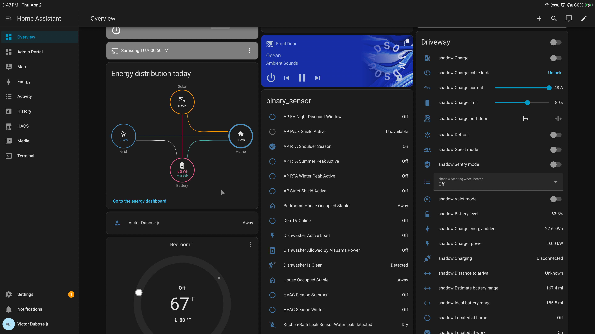
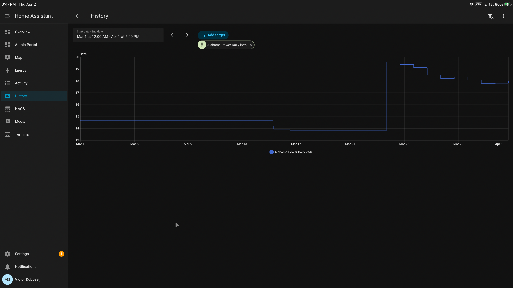

# 🏠 HOME ENERGY POLICY — FINAL SOLAR ARCHITECTURE

Dolomite House — Solar Operational Spec (Final)  
Battery-first, automation-governed residential microgrid design  

---

## 🎯 CORE PRIORITY ORDER

1. Dogs Safety  
2. Human Comfort  
3. Energy Efficiency  
4. Grid Cost Optimization  
5. Battery Preservation  

**Safety overrides cost. Layer 0 always wins.**

---

## 🧱 SYSTEM STRUCTURE — 4.5 ENERGY LAYERS

(See Layers 0 → 2.5 in system documentation)

---

# ⚡ Layer 3 — Energy Optimization (Core System)

## 🎯 Objective

Layer 3 transforms the home into a **self-managed residential microgrid** by controlling:

- When energy is used  
- When energy is stored  
- When energy is deferred  

The goal is not just reducing usage — it is **controlling time**.

---

## 📊 SYSTEM VISIBILITY (REAL-TIME CONTROL)



This dashboard represents:

- Real-time solar generation  
- Battery charge/discharge  
- Grid interaction  
- Device-level control (Tesla, HVAC, loads)  

👉 This is the **live control layer** of the system.

---

## ☀️ SYSTEM HARDWARE BASELINE

- Solar: ~5.98 kW DC (east/west split)  
- Battery: Tesla Powerwall 3 — 13.5 kWh usable  
- Home Load Target: ~12–13 kWh/day  
- Rate Plan: Alabama Power RTA (Time-of-Use)  

---

## ⏱️ OFF-GRID TARGET

```
15–17 hours per day off-grid (standard target)
```

---

## ☀️ SUMMER PERFORMANCE MODEL (BIRMINGHAM, AL)

### 🔋 Battery-Only Runtime

```
13.5 kWh ÷ 12 kWh/day ≈ 1.1 days
```

👉 ~26–28 hours runtime without solar  

---

### ☀️ Solar + Battery Runtime

```
Indefinite off-grid operation during sustained summer sun
```

---

### ✅ Practical Expectation

```
22–24 hours off-grid daily (realistic upper range)
```

---

## ❄️ WINTER PERFORMANCE MODEL

```
Time-constrained instead of energy-constrained
```

---

## 🔄 BATTERY FILL DAYS (CRITICAL)

Scheduled:
- New Year’s Day  
- Labor Day  
- Thanksgiving  
- Christmas  

---

### Purpose

```
Reset battery state and prevent multi-day energy deficit
```

---

### Why This Works

```
These days are excluded from Alabama Power peak rate enforcement
```

Meaning:

- No STRICT windows  
- No penalty for high usage  
- Full-day flexibility  

---

### Strategic Advantage

- Run home fully on grid without penalty  
- Recharge Powerwall to 100%  
- Reset system state  

---

### Design Philosophy

```
Use utility-defined “free” days to reset system state
instead of fighting seasonal solar limitations.
```

---

## ⏱️ TIME ENGINE (RTA GOVERNANCE)

- CHEAP → ~9 PM → 4:45 AM  
- STRICT → Peak windows  
- NORMAL → Everything else  

---

## 🔋 POWERWALL GOVERNANCE

Battery carries when:

- NOT cheap  
- NOT storm override  
- NOT fill day  
- Above reserve (~20%)  

---

## 🚗 TESLA MODEL 3 — ENERGY SINK

Tesla acts as:

```
Dynamic solar overflow absorber
```

---

## ⚡ LOAD SHEDDING STRATEGY

```
Never stack major loads during expensive windows
```

---

## 📈 VALIDATION LAYER (UTILITY VS REAL-TIME)



This chart represents:

- Alabama Power recorded daily kWh usage  
- Utility-side billing data  

---

## 📊 DATA VALIDATION & SOURCE OF TRUTH

### 🔗 Alabama Power Scraper (Source Code)

```
03-RDP-VM-Infrastructure/Docker/alabama-power-scraper.py
```

This script:

- Logs into Alabama Power  
- Scrapes hourly kWh usage  
- Pushes data into Home Assistant  

---

### Real-Time System (Control Layer)

- Tesla Powerwall telemetry (minute-level)  
- Home Assistant calculations  
- Solar + battery flow  

---

### Alabama Power Scraper (Ground Truth)

Provides:

```
Utility-recorded hourly energy usage (billing source of truth)
```

---

### 🧠 Why This Matters

- Validates automation accuracy  
- Detects drift between systems  
- Aligns behavior with actual billing  

---

### 🔁 Closed-Loop System

```
Powerwall → HA logic → automation  
        ↓
Alabama Power → validation → tuning
```

---

## 🧠 SYSTEM BEHAVIOR (DAILY FLOW)

Morning  
→ Battery finishes discharge  

Midday  
→ Solar powers home + charges battery  

Afternoon  
→ Tesla absorbs excess  

Evening  
→ Battery carries home  

Night  
→ Optional grid usage  

---

## 🧠 SYSTEM IDENTITY

```
Residential microgrid with time-based energy control
```

- Solar = generation  
- Powerwall = time-shifting  
- Tesla = energy sink  
- HA = orchestrator  
- Grid = fallback  

---

## 🧠 FINAL SUMMARY

Layer 3 enables:

- ~17 hours off-grid baseline  
- Near full-day off-grid in summer  
- Stable winter operation via reset strategy  
- Verified energy tracking using utility data  
- Intelligent load coordination  

---

## ⚡ ONE-LINE SUMMARY

```
Layer 3 converts solar production into time-controlled independence,
validated against real utility billing data.
```
