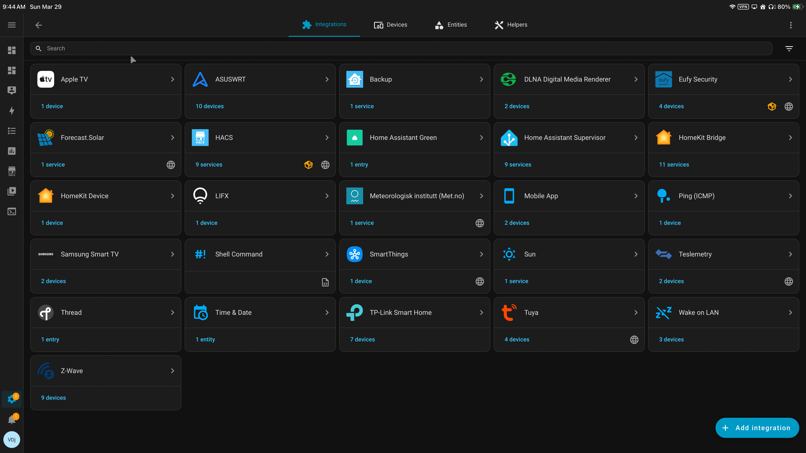
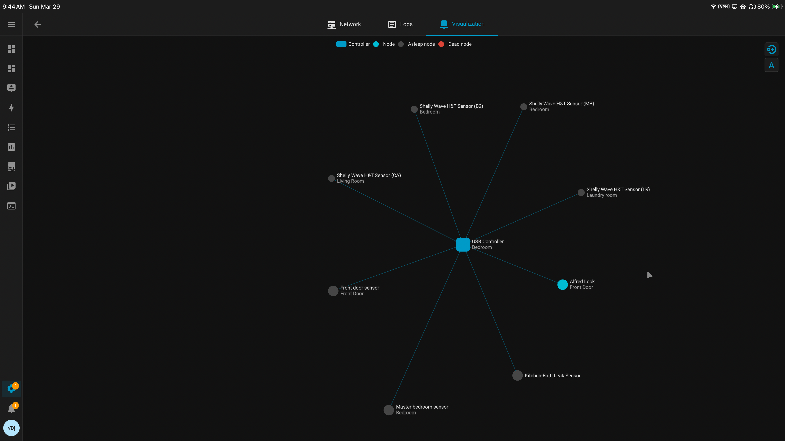

# Home Assistant — Core Automation System

Home Assistant functions as the local automation brain of the Dolomite house.

It is responsible for:

- safety enforcement  
- HVAC orchestration  
- presence-aware control  
- appliance and load management  
- battery-governed energy logic  
- backend coordination with Apple Home  

This system is designed as a **layered residential automation platform**, not a collection of unrelated smart devices.

---

## Role in the Overall Architecture

The house follows a front-end / back-end split:

- **Apple Home = front end**
  - polished UI and remote access (HomePod / Apple TV)
  - Siri voice control and notifications  
  - simple scenes and human interaction  

- **Home Assistant = back end**
  - local-first automation engine  
  - energy optimization and cost control  
  - HVAC and presence policy  
  - device orchestration  
  - system-wide logic and decision making  

**Apple Home handles people.  
Home Assistant handles physics and cost.**

If Apple Home is unavailable, automation continues.  
If Home Assistant is unavailable, manual control remains.

---

## Platform and Device Strategy

The system runs on a **Home Assistant Green**, connected via **wired RJ45 Ethernet** for stability and reliability.

A locally attached **Z-Wave dongle** provides low-power mesh communication for infrastructure devices.

### Preferred Protocols

The system prioritizes:

- **Z-Wave**
- **Matter**

These are used wherever possible instead of Wi-Fi devices.

### Why Z-Wave

Z-Wave is the preferred protocol for battery-powered devices because it provides:

- low-power mesh networking  
- strong reliability in residential environments  
- significantly improved battery longevity  
- fully local operation (no cloud dependency)  

Used for:

- temperature sensors  
- leak sensors  
- door sensors  
- locks  
- environmental monitoring  

### Why Matter

Matter is used as the forward-looking ecosystem layer:

- cross-platform compatibility  
- Apple / Google / HA interoperability  
- simplified device onboarding  
- future-proof standard  

**Strategy:**
- Z-Wave → infrastructure + sensors  
- Matter → ecosystem + user-facing devices  

---

## System Visibility

### Integrations Overview

  

This view shows the full integration layer of the system, including:

- Tesla Powerwall + energy telemetry  
- Eufy security system  
- Kasa smart plugs with power monitoring  
- Tuya HVAC integration  
- HomeKit bridge  
- Z-Wave network  
- system-level services  

This demonstrates a **multi-vendor, locally orchestrated smart home environment**.

---

### Z-Wave Device Network

  

This visualization shows the Z-Wave mesh network centered on the Home Assistant Green.

It represents:

- distributed sensor placement  
- mesh communication paths  
- low-power infrastructure device topology  

This network forms the backbone of:

- safety monitoring  
- environmental sensing  
- presence support  
- automation triggers  

---

## Current System State

The Home Assistant layer is now part of a fully built, production-level smart home platform.

### Core Systems Complete

- 4-zone mini-split HVAC system  
- Layer 0 safety architecture  
- Layer 1 dog comfort system  
- Layer 2 human comfort logic  
- Alabama Power scraper automation  
- network infrastructure (RJ45 + segmentation)  
- Apple Home bridge integration  
- load-shaving system  
- presence system hardening  
- power monitoring deployment  

---

## Layered Control Model

The system is structured into layered priorities.

### Layer 0 — Safety Protection

Always active. Never negotiates.

- freeze protection  
- leak detection  
- extreme cold safeguards  
- power recovery logic  

---

### Layer 1 — Dog Baseline Protection

Maintains safe environment regardless of cost.

- safe range enforced at all times  
- living room = baseline zone  
- STRICT mode never overrides safety  

---

### Layer 2 — Human Comfort

Conditioned only when permitted.

- bedrooms → adaptive recovery  
- den → activity-driven (TV logic)  
- away → zones OFF  

---

### Layer 2.5 — Passive Control (Blinds)

Planned system:

- sleep window: closed  
- winter: open for heat gain  
- summer: closed for heat rejection  

Purpose:
- reduce HVAC demand  
- reduce lighting load  

---

### Layer 3 — Energy Optimization

Battery-first energy control system.

Controls:

- utility time windows  
- Powerwall behavior  
- Tesla charging  
- solar overflow  
- load coordination  

---

## Climate Control Philosophy

Designed to be:

- safe  
- predictable  
- energy-aware  
- manually overridable  
- resilient  

### Structure

- living room → baseline  
- bedrooms → adaptive recovery  
- den → activity-triggered  

### Presence Model

Presence grants permission—not temperature.

Hierarchy:

1. Eufy Security  
2. Apple Home  
3. Home Assistant arbitration  

Fail-open rule:

> If uncertain → assume occupied

---
### Alfred DB1 Z-Wave Smart Lock — Entry Validation & Audit Layer

The home uses an Alfred DB1 Z-Wave Smart Lock as a secure entry validation device rather than a simple access mechanism.

### Core Capabilities

- User-attributed entry (PIN-based)  
  • Each unlock event identifies who entered the home  
  • Enables per-user accountability and tracking  

- Real-time alerts (Apple Home)  
  • Immediate notifications when the door is unlocked  
  • Provides a clean, user-facing event layer  

- System-level logging (Home Assistant)  
  • Tracks how the door was unlocked:  
    • keypad entry  
    • Apple Home action  
    • manual override  
  • Maintains a reliable source-of-truth audit trail  

- Multi-layer fallback access  
  • Physical key backup  
  • Emergency battery charge capability  

---

### Why Z-Wave Was Chosen

This device is part of critical infrastructure, not convenience automation.

Z-Wave provides:

- reliable local communication (no cloud dependency)  
- low power consumption resulting in extended battery life  
- stable performance independent of Wi-Fi congestion  

---

### System Design Philosophy

Instead of using the lock for presence detection, the system treats it as an entry validation layer.

> Entry is validated, attributed, and logged — not just detected.

This allows the system to:

- confirm who entered  
- verify how entry occurred  
- maintain consistent records across both Home Assistant and Apple Home  

---

### Architectural Alignment

This approach reflects the broader system design:

- devices are assigned roles based on function  
- critical systems prioritize reliability and auditability  
- automation supports awareness, not just convenience

---

## Energy Control Philosophy

The system operates as a **battery-governed residential microgrid**.

### Priority Order

1. dog safety  
2. human comfort  
3. energy efficiency  
4. cost optimization  
5. battery preservation  

---

### Time Engine

- CHEAP  
- STRICT  
- NORMAL  

With early cutoff:

→ **4:45 AM buffer**

---

### Powerwall Strategy (Staged)

Battery carries the home when:

- not CHEAP  
- not storm mode  
- above reserve  

---

### Tesla as Energy Sink

Used for:

- cheap charging  
- emergency override  
- solar overflow absorption  

---

## Appliance and Load Control

Appliances are treated as **managed electrical loads**, not passive devices.

Examples:

- dishwasher CHEAP window enforcement  
- washer/dryer scheduling  
- load stacking prevention  
- freeze heater coordination  

Goal:

> No uncontrolled energy spikes  
> No peak stacking  

---

## Operational Philosophy

- automation assists — never traps  
- safety overrides cost  
- presence grants permission  
- dogs override efficiency  
- solar replaces grid, not discipline  
- manual control always exists  

---

## Remaining Work

The system is no longer in build phase.

Now focused on:

- deployment timing  
- tuning  
- hardware additions  
- refinement  

### Current Priorities

1. full Layer 3 deployment  
2. washer/dryer automation polish  
3. smart blinds installation  
4. security automation cleanup  
5. energy tuning after rollout  

---

## Final System Identity

**server-backed, locally controlled, battery-governed residential automation platform**

with:

- layered safety architecture  
- presence-driven control  
- energy-aware orchestration  
- hardened infrastructure  
- staged deployment strategy  
