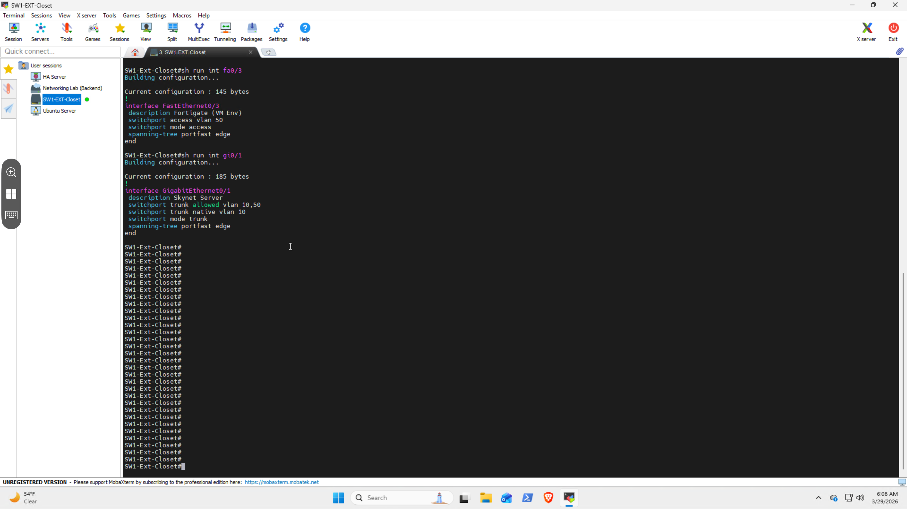

# EVE-NG Network Lab Environment

This directory documents the EVE-NG (Emulated Virtual Environment – Next Generation) virtual machine and its integration into the physical network infrastructure.

EVE-NG provides a full-featured network simulation environment used for:

- CCNA / CCNP lab development
- enterprise topology testing
- routing and switching scenarios
- firewall and segmentation testing
- hybrid (virtual + physical) network experimentation

---

# 🧠 Purpose

The EVE-NG VM functions as a **dedicated network lab environment** that is:

- isolated from the production home network
- capable of simulating enterprise architectures
- integrated with the physical network in a controlled manner

This allows realistic testing without risking disruption to live smart home systems.

---

# 🔌 Hybrid Lab Network Design (VLAN 50)

## Overview

The EVE-NG environment is integrated into the physical network using a dedicated VLAN.

- **VLAN ID:** 50  
- **Purpose:** Network lab / testing environment  
- **Scope:** EVE-NG traffic only  

This VLAN creates a **segmented lab network** that allows controlled interaction between virtual and physical systems.

---

## Architecture

The RDP infrastructure server connects to the physical switch using a **1Gb trunk port**.

This trunk carries:

- VLAN 10 → Production home network  
- VLAN 50 → EVE-NG lab environment  

Inside the server:

- Ubuntu host receives trunked VLAN traffic
- EVE-NG VM attaches to VLAN 50 through bridging
- production services remain on VLAN 10

This creates a **true hybrid environment** combining:

- virtual lab topology
- physical network segmentation

---

## Hybrid Capability

This design enables:

### Internal Lab Simulation
- router-to-router communication
- switching and VLAN simulation
- full topology builds inside EVE-NG
- firewall and ACL testing

### External Integration (Controlled)
- lab devices can interface with VLAN 50
- physical network interaction when needed
- realistic enterprise boundary testing

---

## Isolation Strategy

VLAN 50 is intentionally isolated from the main home network.

### Key Rules

- no production devices exist in VLAN 50  
- lab traffic is fully separated from smart home traffic  
- Home Assistant and automation systems are unaffected  
- failures inside the lab cannot impact live infrastructure  

This allows:

- safe misconfiguration testing  
- routing loop testing  
- firewall rule validation  
- full experimentation without risk  

---

## Why VLAN 50 Exists

This design avoids two common problems:

| Approach | Problem |
|--------|--------|
| Fully isolated lab | Not realistic |
| Fully bridged lab | Risky to production |
| **Dedicated VLAN (used here)** | Safe + realistic |

This mirrors enterprise environments where:

- lab networks are segmented
- access is controlled
- production traffic is protected

---

# 🔧 Physical Switch Integration (Live Configuration)

The following screenshot shows the actual switch configuration used to support the hybrid EVE-NG lab environment.

<p align="center">
  
</p>

---

## Access Port (Lab Segment)

- Interface: **FastEthernet0/3**  
- Mode: Access  
- VLAN: 50  
- Purpose: Dedicated lab network segment for EVE-NG  

```text
interface FastEthernet0/3
 description Lab Environment (VM / Firewall Testing)
 switchport access vlan 50
 switchport mode access
 spanning-tree portfast edge
```

Got you — here’s the clean, single copyable block for the entire second half, already formatted consistently and ready to paste 👇

⸻


## Trunk Port (RDP Infrastructure Server)

- **Interface:** GigabitEthernet0/1  
- **Mode:** Trunk  
- **Allowed VLANs:** 10, 50  
- **Native VLAN:** 10  
- **Purpose:** Carries both production and lab traffic to the RDP infrastructure server  

```text
interface GigabitEthernet0/1
 description Skynet Server
 switchport trunk allowed vlan 10,50
 switchport trunk native vlan 10
 switchport mode trunk
 spanning-tree portfast edge
```
---
Access Port (Hybrid Lab Uplink)
- Interface: FastEthernet0/3
- Mode: Access
- VLAN: 50
- Purpose: Extends the EVE-NG lab environment into physical infrastructure
	
```
interface FastEthernet0/3
 description Lab Environment (Physical Firewall Uplink)
 switchport access vlan 50
 switchport mode access
 spanning-tree portfast edge
```
---

Hybrid Lab Expansion (Physical Integration)

Port 3 connects to a physical firewall, which serves as the entry point into an extended lab environment.

Connected Hardware
- Palo Alto PA-440 (firewall)
- 1 × Cisco Catalyst 9200 (48-port switch)
- 1 x Cisco Catalyst 2960 (48-port switch)  

This allows the EVE-NG environment to extend beyond the limits of the virtual machine and into real hardware.

---
Purpose of Physical Expansion

EVE-NG provides strong virtual simulation but is limited by:
- CPU resources
- memory constraints
- single-host scaling limits

By extending VLAN 50 into physical hardware, the lab can:
- offload switching and routing workloads
- simulate larger enterprise environments
- integrate real hardware behavior
- scale beyond VM limitations 

Hybrid Environment Capability

This design creates a true hybrid lab environment:
- virtual routers and switches (EVE-NG)
- physical firewall (Palo Alto)
- physical switching fabric (Catalyst 9200)
  
Supports testing across:
  - virtual-only topologies
  - physical-only segments
  - mixed virtual/physical environments
---

Estimated Lab Capacity

With:
- Palo Alto PA-440 (firewall)
- 1 × Cisco Catalyst 9200 (48-port switch)
- 1 x Cisco Catalyst 2960 (48-port switch) 

Virtual Layer (EVE-NG VM)
  - ~15–30 active nodes depending on load

    
Physical Layer
- 96+ switch ports available
- full VLAN segmentation
- real trunking and spanning-tree behavior
  
Combined Hybrid Capacity

	•	medium enterprise topology simulation
	•	multi-tier networks (access / distribution / core)
	•	firewall segmentation and policy testing
	•	routing scenarios (OSPF, BGP, static)
	•	realistic traffic flow simulation

---

Design Behavior

This configuration enables:

	•	VLAN 50 to remain isolated for lab traffic
	•	VLAN 10 to carry production home network traffic
	•	the RDP server to receive both VLANs
	•	EVE-NG to operate within VLAN 50
	•	physical lab hardware to integrate with virtual topology

---

Operational Note

Due to the network design:

	•	the switch is not directly accessible via VPN
	•	access is performed through the RDP infrastructure server
	•	MobaXterm is used as the centralized CLI access tool

This reinforces the RDP server as the:

central management node for infrastructure and networking

---

Integration with Infrastructure Stack

EVE-NG runs alongside:
- Docker containers (Eufy, Jellyfin, Alabama Power scraper)
- Windows 11 Admin VM


This allows:
- lab testing without impacting automation
- shared compute resources without interference
- centralized system access
---

Design Benefits

This architecture provides:
- safe lab isolation
- realistic enterprise testing
- hybrid virtual + physical integration
- scalable expansion beyond VM limits
-  no risk to production systems
- ability to simulate real-world failures	

---

Role in Overall System

The EVE-NG lab environment serves as:
- ability to simulate real-world failures
- CCNA / CCNP training platform
- network testing environment
- experimentation sandbox
- validation layer before production changes 

