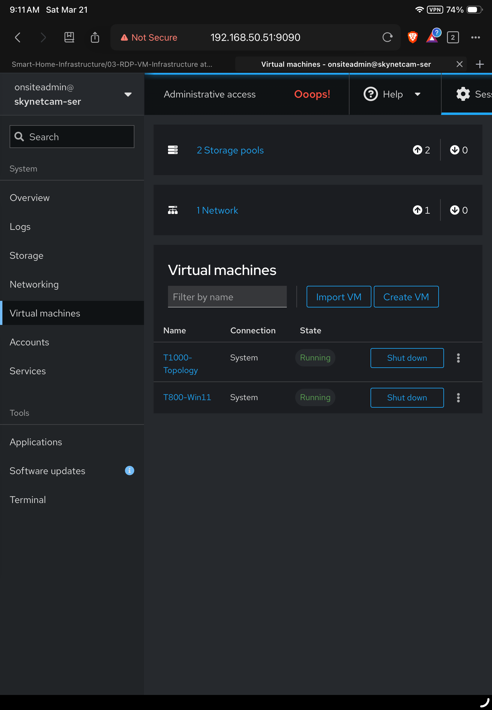

# Virtualization

This directory documents the virtualization layer of the RDP infrastructure server.

Virtualization is used to separate workstation, lab, and infrastructure roles while allowing them to run on a single physical server.

In this environment, virtual machines are used where full operating-system isolation is more appropriate than containerization.

---

## Purpose

The virtualization layer is used to:

- preserve a dedicated Windows administration environment
- support a full network simulation lab
- isolate major workloads from the host operating system
- allow testing and experimentation without risking infrastructure services
- centralize management on one physical platform

This creates a cleaner separation between always-on infrastructure and user-facing administrative workflows.

---

## Virtualization Platform

The server is designed around Linux-hosted virtualization using:

- **KVM**
- **libvirt**
- **Cockpit (web-based management)**

This provides near-native performance while keeping virtualization integrated directly into the server platform.

---

## Virtual Machine Management (Cockpit)

<p align="center">
  
</p>

Cockpit is used as the primary virtualization management interface.

It provides:

- VM lifecycle control (start / stop / restart)
- resource allocation visibility
- console access
- system monitoring
- integration with libvirt

This allows virtual machines to be managed alongside the host system from a single interface.

---

## Virtual Machines

### 1. Windows 11 Administration VM

<p align="center">
  
</p>

**Purpose:** primary administrative workstation

This VM is used for:

- VS Code development
- GitHub repository management
- MobaXterm (SSH / RDP / access hub)
- browser-based infrastructure access
- Windows-only tools and workflows

### Access Model

```text
Administrator → RDP → Windows 11 VM
```
---

## 📁 Subsystems

This virtualization layer is divided into two primary virtual machine environments:

- **Windows 11 Admin VM**  
  Administrative workstation used for infrastructure management, development tools, and centralized access  
  → [`Windows 11Pro/README.md`](./Windows%2011Pro/README.md)

- **EVE-NG Lab Environment**  
  Network simulation platform supporting CCNA / CCNP labs and hybrid virtual + physical testing (VLAN 50)  
  → [`EVE-NG/README.md`](./EVE-NG/README.md)

---
