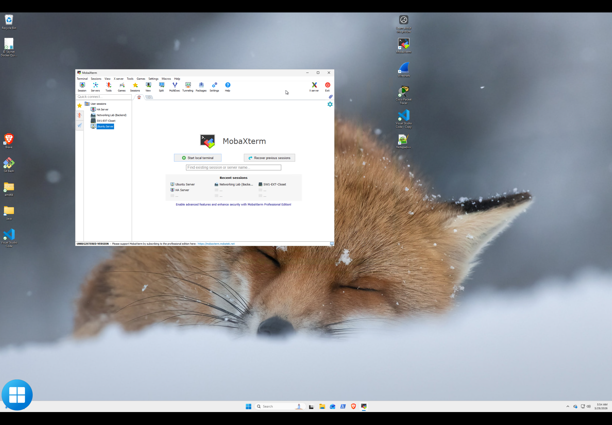

# Windows 11 Administration VM

This virtual machine provides the primary administrative workstation environment for the infrastructure server.

Rather than running Windows directly on the hardware, it is virtualized to separate user workflows from the underlying infrastructure layer.

---

## Live Environment (Windows Admin VM)

<p align="center">
  
  
  
</p>

The Windows VM serves as the daily control interface for the infrastructure.

The screenshot above shows:

- MobaXterm acting as the unified access dashboard
- active infrastructure session management
- centralized access to:
  - Ubuntu host (SSH)
  - networking lab environments
  - Home Assistant backend systems

---

## Purpose

The Windows VM is used for:

- daily system administration
- VS Code development and GitHub management
- MobaXterm (SSH / RDP / access hub)
- browser-based access to infrastructure services
- running Windows-specific tools

It acts as the **human interface layer** of the system.

---

## Access Model

The VM is accessed using Remote Desktop:

```text
Administrator → RDP → Windows 11 VM
