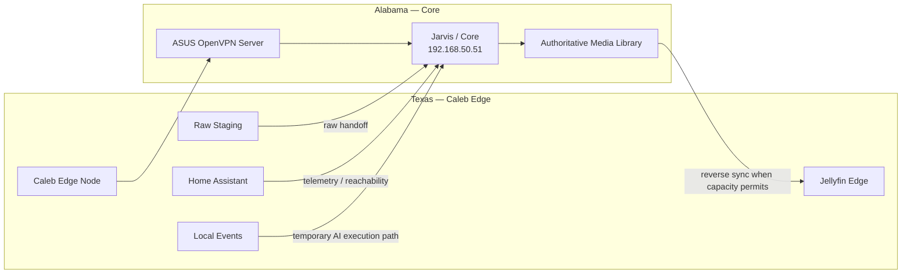

# Alabama ↔ Texas Architecture

Caleb operates remotely in Texas and reaches the Alabama home network through an OpenVPN tunnel hosted by the home ASUS router.

The preferred behavior is split tunneling: ordinary Texas internet traffic stays local while Alabama home-lab traffic uses the VPN.
