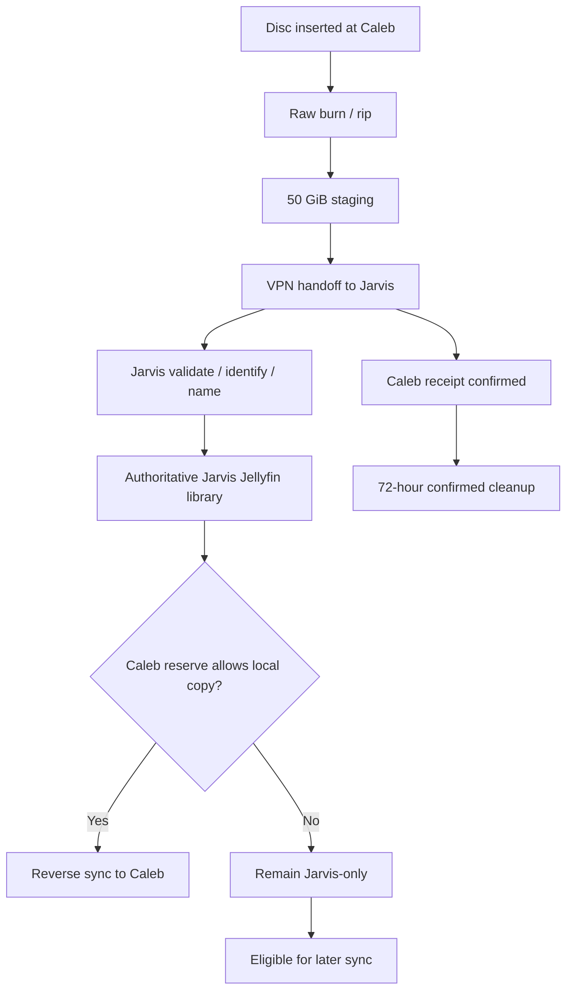

# End-to-End Media Lifecycle

```mermaid
flowchart TD
  A[Disc inserted at Caleb] --> B[Raw burn / rip]
  B --> C[50 GiB staging]
  C --> D[VPN handoff to Jarvis]
  D --> E[Jarvis validate / identify / name]
  E --> F[Authoritative Jarvis Jellyfin library]
  F --> G{Caleb reserve allows local copy?}
  G -->|Yes| H[Reverse sync to Caleb]
  G -->|No| I[Remain Jarvis-only]
  I --> J[Eligible for later sync]
  D --> K[Caleb receipt confirmed]
  K --> L[72-hour confirmed cleanup]
```

The catalog may remain visible independently of whether `H` has happened.
