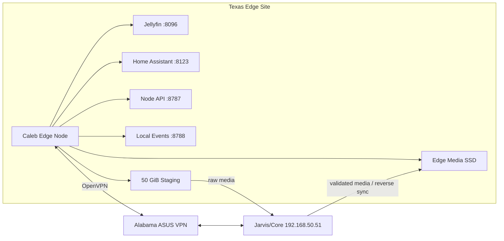

# Caleb Edge Node Architecture

```mermaid
flowchart LR
  subgraph TX[Texas Edge Site]
    EDGE[Caleb Edge Node]
    JF[Jellyfin :8096]
    HA[Home Assistant :8123]
    API[Node API :8787]
    LE[Local Events :8788]
    ST[50 GiB Staging]
    SSD[Edge Media SSD]
    EDGE --> JF
    EDGE --> HA
    EDGE --> API
    EDGE --> LE
    EDGE --> ST
    EDGE --> SSD
  end

  EDGE <-->|OpenVPN| ROUTER[Alabama ASUS VPN]
  ROUTER <--> CORE[Jarvis/Core 192.168.50.51]
  ST -->|raw media| CORE
  CORE -->|validated media / reverse sync| SSD
```
