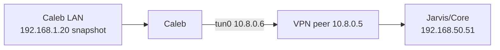

# Network Path

```mermaid
flowchart LR
  LAN[Caleb LAN
192.168.1.20 snapshot] --> EDGE[Caleb]
  EDGE -->|tun0 10.8.0.6| PEER[VPN peer 10.8.0.5]
  PEER --> CORE[Jarvis/Core
192.168.50.51]
```

The LAN address is not an invariant; the VPN/Core route is the meaningful inter-site path.
