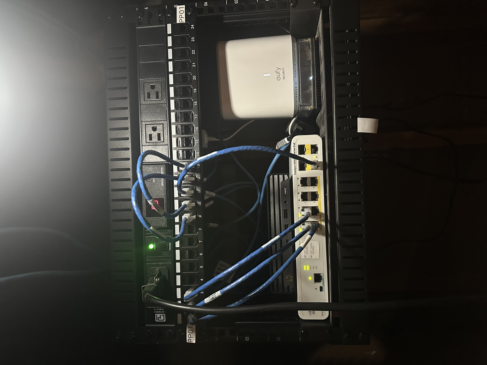
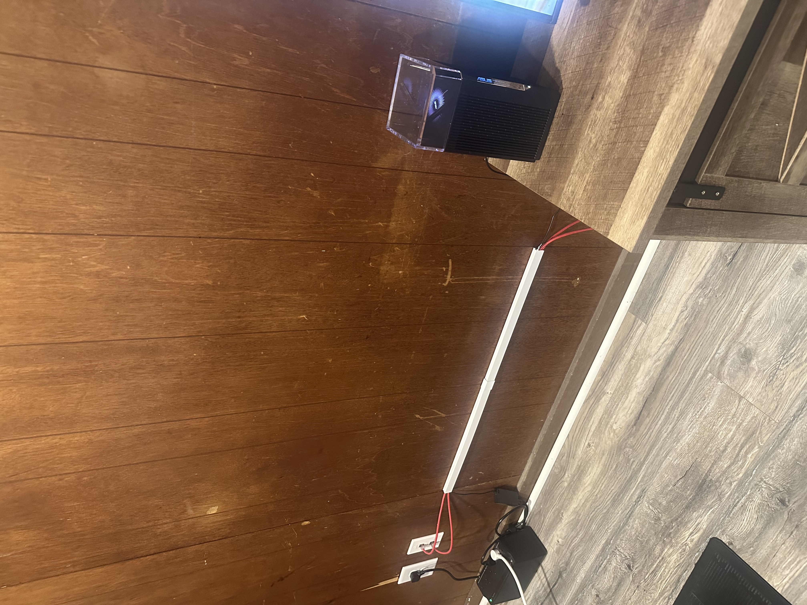
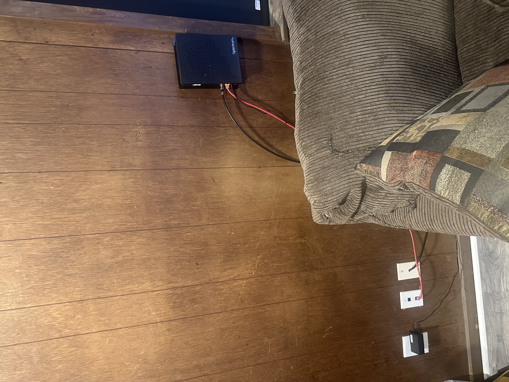
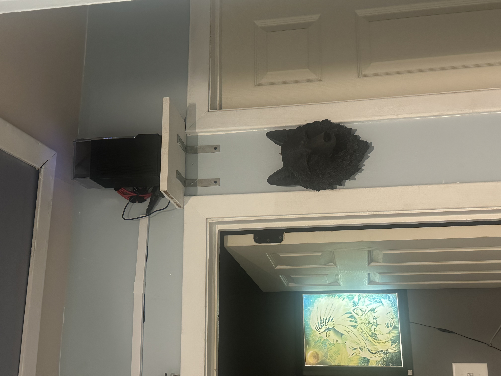

# 🌐 Home Network Architecture — Optimized Design

This network is designed to support a fully automated smart home system with high reliability, low latency, and efficient bandwidth utilization.

---

## 🎯 Design Goals

- Eliminate double NAT
- Centralize routing, firewall, and DHCP
- Maximize Wi-Fi performance using wired backhaul
- Allocate bandwidth intelligently across devices
- Maintain a simple, flat, and reliable LAN

---

## 🧱 Core Architecture

Internet → Bridged ISP Modem → ASUS Router → Mesh Node → Cisco Switch → Devices

## Physical Network Topology

```text
ASCII DIAGRAM (real cabling)

 Internet
   │
   │ (Public IP →)
┌──▼──────────────────────────┐
│ Spectrum Gateway (BRIDGE)   │  modem-only
└──┬──────────────────────────┘
   │ WAN
┌──▼──────────────────────────────────┐
│ ASUS ZenWiFi Pro ET12  (PRIMARY)    │  Router / NAT / DHCP / Wi-Fi
│ • LAN 2.5G ──────────────┐          │
└──┬───────────────────────┘          │
   │                                  │
   │  (Wired Backhaul 2.5G ↔ 2.5G)    │
┌──▼────────────────────────┐         │
│ ASUS ZenWiFi Pro ET12     │  NODE / AiMesh
│ • LAN 1G →────────────┐   │
│ • LAN 1G → Xbox       │   │
│ • WAN unused          │
└──┬────────────────────┘
   │
   │  (1G uplink)
┌──▼───────────────────────────────────────────┐
│ Cisco Catalyst 2960-C (L2)                   │
│ G0/1  ← Uplink from Node LAN 1G              │ 
│                                              │
│ ─── Infrastructure Segment ───────────────── │
│  • Home Assistant Green                      │
│  • Eufy Security Hub                         │
│                                              │
│ ─── Lab / Server Segment ─────────────────── │
│  • Remote Desktop host (Ubuntu / Docker)     │
│  • Automation scripts / dev environment      │
│                                              │
│ ─── IoT / Low-Bandwidth Segment ──────────── │
│  • Smart home IoT devices                    │
│  • Sensors / hubs                            │
│  • Other low-bandwidth endpoints             │
└──────────────────────────────────────────────┘
```
<p align="center">
  
 
 
 
</p>

---

## 🔌 Key Components

### ISP Gateway (Spectrum)
- Configured in **bridge mode**
- Functions only as a modem
- Passes public IP directly to ASUS router

### ASUS ZenWiFi Pro ET12 (Primary)
- Main router (NAT, DHCP, firewall)
- Handles all network intelligence
- Provides Wi-Fi 6E coverage
- DHCP range: 192.168.x.100–199

### ASUS ZenWiFi Pro ET12 (Node)
- Connected via **2.5G wired backhaul**
- Extends Wi-Fi coverage
- Acts as distribution point for wired devices

### Cisco Catalyst 2960-C (Layer 2)
- all on Vlan 10
- VLan 50 is exclusively a Lab Test environment for the EVE-NG environment segmenting it from my home netowork for safety with only the RDP located in both VLAns through trunking techniques.
- Provides wired connectivity
- Uplinked to mesh node (not primary router)
- Fast Ethernet ports used for low-bandwidth devices
- one foot standard utilized effectively across the network with color associated importance

---

## ⚡ Performance Strategy

- High-demand devices (Xbox, laptops) use **gigabit paths**
- Low-demand devices (HA, Eufy, IoT) use **100 Mbps ports**
- Wired backhaul ensures **stable Wi-Fi performance**
- Single flat subnet simplifies routing and automation

---

## 🔐 Security & Stability

- Single NAT boundary (ASUS router)
- No double NAT
- Centralized firewall enforcement
- DNS-over-TLS enabled
- No VLAN complexity (intentional design decision)

  <p align="center">
  
   
   
  </p>
---

## 🧠 Design Philosophy

This network prioritizes:

- simplicity over unnecessary segmentation  
- performance through correct device placement  
- reliability through minimal failure points  

It is intentionally designed as a **single, efficient Layer 2 domain** with a strong Layer 3 edge. with my switch operating as a augmented router on a stick setup.

---

## 🔗 Integration with Home Assistant

- Home Assistant operates entirely within the LAN
- No external exposure required
- All automations rely on stable internal routing
- Apple Home acts as the user-facing layer
- RDP allows local remote ssh access through the instant guard vpn

---

## 📸 Physical Implementation

See `/screenshots` for real-world deployment:
- rack setup
- cable runs
- router placement
- modem configuration
