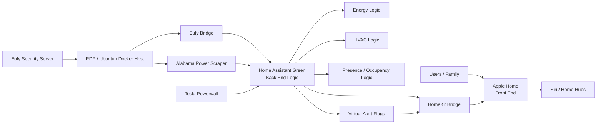

# Smart-Home-Infrastructure
Residential smart home lab integrating Home Assistant, network infrastructure, virtualization, and energy automation.

# Smart Home Infrastructure & Automation Lab

<p align="center">
  
    
</p>

A portfolio repository documenting the architecture and automation systems used in my residential smart home lab.

This project integrates **Home Assistant, network engineering, virtualization, automation, and energy management** to create a fully automated residential infrastructure platform.

The system demonstrates real-world applications of:

- Infrastructure automation
- IoT system integration
- Energy optimization
- Network engineering
- DevOps-style configuration management

---

## Core Engineering Objective

This project was originally motivated by a practical engineering question:

**How much can residential cost of living be reduced through infrastructure automation and energy system optimization?**

The system was designed to minimize two major household operating costs:

- grid electricity consumption
- fossil fuel energy usage

To achieve this, the home was converted into a **fully electric, energy-aware automation platform** using solar generation, battery storage, and intelligent device orchestration.

Key strategies implemented include:

- shifting appliance usage to low-cost utility time windows
- maximizing solar self-consumption
- using battery storage to avoid peak grid pricing
- automating HVAC operation based on occupancy and environmental conditions
- coordinating EV charging with energy pricing and solar production

By treating the house as an **engineering system rather than a collection of smart devices**, the project explores how infrastructure automation can materially reduce the long-term cost of living.

This repository documents the architecture, automation design, and infrastructure used to operate this system.

---
## Engineering Methodology (SDLC-Informed Design)

This system was developed using a simplified **Software Development Lifecycle (SDLC)** approach adapted to residential infrastructure.

Instead of building isolated automations, the project follows a structured workflow:

- **Problem Definition** → reduce cost of living through energy and infrastructure optimization  
- **System Design** → separate responsibilities across Home Assistant (logic), Apple Home (interface), and network infrastructure (transport)  
- **Implementation** → YAML automations, Docker services, and network configuration  
- **Testing & Validation** → real-world verification of automation behavior, energy savings, and remote access  
- **Documentation** → modular repository structure with architecture breakdowns  
- **Iteration** → continuous refinement based on live system performance  

This approach ensures the system behaves as a **cohesive engineered platform**, not a collection of smart devices.

---

## Project Scope

The system manages a live residential automation environment including:

- Multi-zone HVAC automation
- Energy optimization using solar and battery storage
- EV charging coordination
- Security camera integration
- Appliance scheduling based on energy pricing
- Network infrastructure supporting automation servers and IoT devices

---

## Project Areas

- **Home Assistant Automation Architecture**  
  Modular automation design using Home Assistant packages.

- **RDP / VM / Docker Lab Environment**  
  Remote desktop host supporting development, automation scripts, and infrastructure services.

- **Network Topology & Infrastructure**  
  Residential network architecture integrating routers, switches, IoT devices, servers, and automation systems.

- **Energy Automation & Load Management**  
  Smart control of HVAC, EV charging, and appliances based on energy pricing and solar production.

- **Git-Based Backup & Disaster Recovery**  
  Automated configuration backup pipeline for Home Assistant using Git and GitHub.

---

## Featured Highlights

- Multi-zone HVAC automation with occupancy awareness
- GitHub-based Home Assistant configuration backup pipeline
- Residential network architecture with managed infrastructure
- Remote desktop / VM environment for automation and development
- Energy-aware device orchestration and load shifting
- Presence detection system design
- Disaster recovery architecture for Home Assistant and automation services
- Server bridge architecture integrating automation services
- Apple HomeKit bridge integration with Home Assistant

---

## Explore the System

- [Architecture Overview](docs/architecture-overview.md)
- [Home Assistant Design](docs/home-assistant-design.md)
- [Network Design]( /network-design.md)
- [RDP / VM Lab](03-RDP-VM-Infrastructure/README.md)
- [Energy Automation](docs/energy-automation.md)

---

## Technology Stack

### Automation & IoT
- Home Assistant
- Apple HomeKit (via HomeKit Bridge)
- HomeKit Controller
- Tuya / Smart Life
- Eufy Security

### Network Infrastructure
- ASUS ZenWiFi Pro ET12 mesh router system
- Residential gigabit Ethernet backbone
- IoT device segmentation and managed routing
- Dedicated network connections for automation servers and infrastructure devices

### Infrastructure
- Linux / Docker-based services
- Remote Desktop automation environment
- Virtualization for development and infrastructure services

### Energy Systems
- Tesla Powerwall integration
- Solar generation monitoring
- EV smart charging automation
- Time-of-use energy optimization

### Development
- Git / GitHub configuration management
- 

---
HOME NETWORK + HA ⇄ APPLE HOME

HA – Home Assistant

HK – HomeKit Bridge

AH – Apple Home

RDP – Remote development host
---

## Physical Network Topology

```text
ASCII DIAGRAM (real cabling)

 Internet
   │
   │ (Public IP →)
┌──▼──────────────────────────┐
│ Spectrum Gateway (BRIDGE)   │  modem-only
└──┬──────────────────────────┘
   │ WAN
┌──▼──────────────────────────────────┐
│ ASUS ZenWiFi Pro ET12  (PRIMARY)    │  Router / NAT / DHCP / Wi-Fi
│ • LAN 2.5G ──────────────┐          │
└──┬───────────────────────┘          │
   │                                  │
   │  (Wired Backhaul 2.5G ↔ 2.5G)    │
┌──▼────────────────────────┐         │
│ ASUS ZenWiFi Pro ET12     │  NODE / AiMesh
│ • LAN 1G →────────────┐   │
│ • LAN 1G → Xbox       │   │
│ • WAN unused          │
└──┬────────────────────┘
   │
   │  (1G uplink)
┌──▼───────────────────────────────────────────┐
│ Cisco Catalyst 2960-C (L2)                   │
│ G0/1  ← Uplink from Node LAN 1G              │ 
│                                              │
│ ─── Infrastructure Segment ───────────────── │
│  • Home Assistant Green                      │
│  • Eufy Security Hub                         │
│                                              │
│ ─── Lab / Server Segment ─────────────────── │
│  • Remote Desktop host (Ubuntu / Docker)     │
│  • Automation scripts / dev environment      │
│                                              │
│ ─── IoT / Low-Bandwidth Segment ──────────── │
│  • Smart home IoT devices                    │
│  • Sensors / hubs                            │
│  • Other low-bandwidth endpoints             │
└──────────────────────────────────────────────┘
```

## Control Architecture



### Implementation
- YAML-based automation architecture
- Python automation scripts


## Economic Impact of Infrastructure Automation

A primary objective of this project is reducing the long-term **cost of living** through infrastructure automation and energy system optimization.

Rather than treating automation as a convenience feature, the system treats the home as an **energy-managed residential infrastructure platform** designed to minimize operating costs across electricity, heating, and transportation.

The home operates as a **fully electric household**, eliminating natural gas usage and integrating solar generation, battery storage, and EV charging automation into a unified energy system.

---

### Energy Infrastructure

The residential energy platform currently integrates:

- **5.81 kW solar generation system**
- **Tesla Powerwall 3 battery storage (13.5 kWh usable capacity)**
- **Fully electric multi-zone mini-split HVAC system**
- **Tesla Model 3 Long Range (used as a managed electrical load)**
- **Home Assistant automation platform coordinating energy usage**

Estimated solar generation:

- **~7,553 kWh annually**

   
  
---

### Typical Household Energy + Transportation Costs (Regional Baseline)

For a typical Alabama household using both electricity, natural gas, and gasoline transportation:

| Category | Typical Annual Cost |
|--------|----------------|
| Electricity | ~$1,800 |
| Natural Gas | ~$500 – $900 |
| Gasoline vehicle fuel | ~$1,500 – $2,200 |
| **Total energy + transportation** | **~$3,800 – $4,900 / year** |

These costs vary depending on energy prices, driving distance, and heating demand.

---

### EV Charging as an Energy-Controlled Load

The Tesla Model 3 Long Range acts as a **high-capacity controllable electrical load** within the automation system.

Charging is coordinated through automation rules that:

- prioritize charging during low-cost overnight electricity windows
- avoid peak energy pricing periods
- coordinate with other large electrical loads in the home
- integrate with solar generation and battery state when available

This allows the EV to function as part of the home’s **managed energy ecosystem** rather than as an uncontrolled power demand.

---

### Estimated Cost Reduction

By combining:

- solar electricity generation
- elimination of natural gas
- EV fuel cost replacement
- automation-driven energy management

the system significantly reduces overall household operating costs.

| Category | Estimated Annual Reduction |
|--------|----------------|
| Solar electricity offset | ~$900 |
| Eliminated natural gas usage | ~$500 – $900 |
| Gasoline replaced by EV charging | ~$1,200 – $1,800 |
| **Total estimated reduction** | **~$2,600 – $3,600 annually** |

These estimates assume moderate driving distances and typical regional fuel and utility pricing.

---

## System Design Philosophy

The smart home is designed using core engineering principles typically applied to distributed systems:

- **Separation of Concerns**
  - Home Assistant → automation and logic  
  - Apple Home → user interface and communication  
  - Network infrastructure → connectivity and security  

- **Local-First Architecture**
  - all critical systems operate داخل the local network  
  - remote access is achieved securely via VPN (Asus Instant Guard)  
  - no direct exposure of internal services to the public internet  

- **Controlled Exposure (Allowlist Model)**
  - only human-relevant entities are exposed to Apple Home  
  - backend logic, telemetry, and system internals remain isolated  

- **System-as-Infrastructure Mindset**
  - HVAC, EV charging, and appliances are treated as coordinated system components  
  - energy usage is orchestrated, not reactive  
  - automation decisions are based on state, timing, and cost conditions  

This design allows the home to function as a **stable, scalable, and production-like infrastructure system**.
