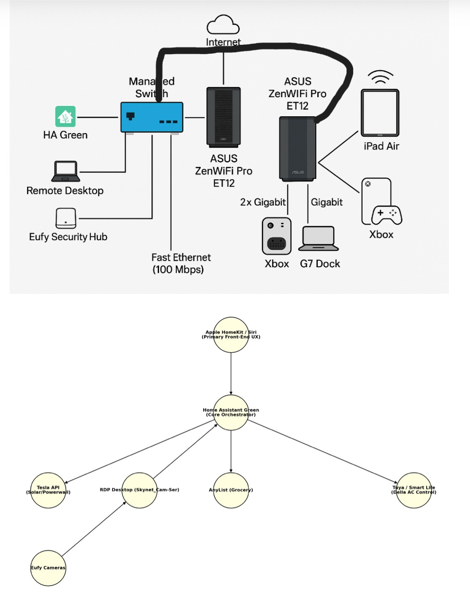

# Smart-Home-Infrastructure
Residential smart home lab integrating Home Assistant, network infrastructure, virtualization, and energy automation.

# Smart Home Infrastructure & Automation Lab



A portfolio repository documenting the architecture and automation systems used in my residential smart home lab.

This project integrates **Home Assistant, network engineering, virtualization, automation, and energy management** to create a fully automated residential infrastructure platform.

The system demonstrates real-world applications of:

- Infrastructure automation
- IoT system integration
- Energy optimization
- Network engineering
- DevOps-style configuration management

---

## System Goals

The project was designed to demonstrate practical infrastructure engineering through a real residential deployment environment.

Primary goals include:

- Reliable smart home automation architecture
- Energy optimization and load management
- Resilient system backup and disaster recovery
- Integration of multiple IoT ecosystems
- Modular automation development using version-controlled configuration

---

## Project Scope

The system manages a live residential automation environment including:

- Multi-zone HVAC automation
- Energy optimization using solar and battery storage
- EV charging coordination
- Security camera integration
- Appliance scheduling based on energy pricing
- Network infrastructure supporting automation servers and IoT devices

---

## Project Areas

- **Home Assistant Automation Architecture**  
  Modular automation design using Home Assistant packages.

- **RDP / VM / Docker Lab Environment**  
  Remote desktop host supporting development, automation scripts, and infrastructure services.

- **Network Topology & Infrastructure**  
  Residential network architecture integrating routers, switches, IoT devices, servers, and automation systems.

- **Energy Automation & Load Management**  
  Smart control of HVAC, EV charging, and appliances based on energy pricing and solar production.

- **Git-Based Backup & Disaster Recovery**  
  Automated configuration backup pipeline for Home Assistant using Git and GitHub.

---

## Featured Highlights

- Multi-zone HVAC automation with occupancy awareness
- GitHub-based Home Assistant configuration backup pipeline
- Residential network architecture with managed infrastructure
- Remote desktop / VM environment for automation and development
- Energy-aware device orchestration and load shifting
- Presence detection system design
- Disaster recovery architecture for Home Assistant and automation services
- Server bridge architecture integrating automation services
- Apple HomeKit bridge integration with Home Assistant

---

## Explore the System

- [Architecture Overview](docs/architecture-overview.md)
- [Home Assistant Design](docs/home-assistant-design.md)
- [Network Design](docs/network-design.md)
- [RDP / VM Lab](docs/rdp-vm-stack.md)
- [Energy Automation](docs/energy-automation.md)

---

## Technology Stack

### Automation & IoT
- Home Assistant
- Apple HomeKit (via HomeKit Bridge)
- HomeKit Controller
- Tuya / Smart Life
- Eufy Security

### Network Infrastructure
- ASUS ZenWiFi Pro ET12 mesh router system
- Residential gigabit Ethernet backbone
- IoT device segmentation and managed routing
- Dedicated network connections for automation servers and infrastructure devices

### Infrastructure
- Linux / Docker-based services
- Remote Desktop automation environment
- Virtualization for development and infrastructure services

### Energy Systems
- Tesla Powerwall integration
- Solar generation monitoring
- EV smart charging automation
- Time-of-use energy optimization

### Development
- Git / GitHub configuration management
- 
========================
HOME NETWORK + HA ⇄ APPLE HOME
========================

## Physical Network Topology

ASCII DIAGRAM (real cabling)

Internet
   │
   │ (Public IP)
┌──▼──────────────────────────┐
│ Spectrum Gateway (BRIDGE)   │  Modem-only
└──┬──────────────────────────┘
   │ WAN
┌──▼──────────────────────────────────┐
│ ASUS ZenWiFi Pro ET12 (PRIMARY)     │  Router / NAT / DHCP / Wi-Fi
│ • 2.5G LAN ────────────────┐        │
└──┬─────────────────────────┘        │
   │                                  │
   │  Wired backhaul (2.5G ↔ 2.5G)    │
┌──▼────────────────────────────┐     │
│ ASUS ZenWiFi Pro ET12 (NODE)  │  AiMesh Node
│ • 1G LAN → Cisco Switch       │
│ • 1G LAN → Xbox One X         │
│ • WAN unused                  │
└──┬────────────────────────────┘
   │
   │  1G uplink
┌──▼───────────────────────────────┐
│ Cisco Catalyst 2960-C (L2)       │
│ • G0/1: Uplink from Node LAN 1G  │
│ • FE ports (100 Mbps):           │
│    - Home Assistant Green        │
│    - Eufy Security Hub           │
│    - RDP thin client / server    │
│    - Other low-bandwidth IoT     │
└──────────────────────────────────┘

---

## Control Architecture

```mermaid
flowchart LR
    USERS[Users / Family] --> AH[Apple Home<br/>Front End]
    AH --> SIRI[Siri / Home Hubs]

    HA[Home Assistant Green<br/>Back End Logic] --> HK[HomeKit Bridge]
    HK --> AH

    RDP[RDP / Ubuntu / Docker Host] --> EUFYBRIDGE[Eufy Bridge]
    RDP --> APSCRAPER[Alabama Power Scraper]

    EUFYBRIDGE --> HA
    APSCRAPER --> HA

    HA --> ENERGY[Energy Logic]
    HA --> HVAC[HVAC Logic]
    HA --> PRESENCE[Presence / Occupancy Logic]
    HA --> ALERTS[Virtual Alert Flags]

    ALERTS --> HK

### Implementation
- YAML-based automation architecture
- Python automation scripts

```

