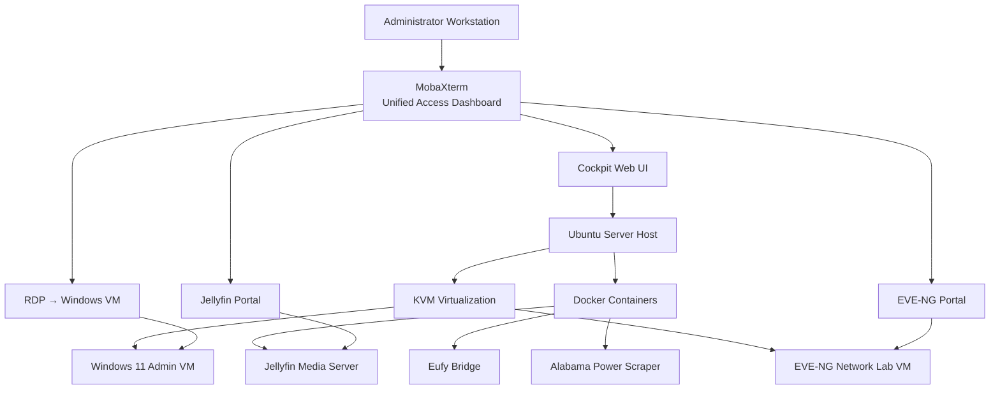

# RDP Infrastructure Server

Remote infrastructure server supporting automation services, virtualization, development tools, and network engineering labs.

This server functions as a **central infrastructure node** within the smart home lab environment and provides the compute platform for automation support services, network simulations, and development workflows.

The system combines:

* Linux infrastructure hosting
* containerized automation services
* virtualized development environments
* network engineering labs
* centralized infrastructure access

---

# Infrastructure Architecture

The server runs multiple workloads while maintaining **low operational complexity and centralized management**.

Primary roles of the infrastructure node include:

* hosting support services used by Home Assistant
* running containerized integrations and automation tools
* providing a Windows administrative workstation
* supporting a full CCNA / CCNP network simulation lab
* hosting a residential media streaming server
* acting as a development platform for automation scripts

The environment is intentionally designed to **minimize operational complexity** through a limited number of management portals and centralized access.

---

# RDP Stack Architecture

The infrastructure follows a layered architecture separating:

* hardware resources
* host operating system
* container services
* virtual machines
* management interfaces



This architecture allows the entire infrastructure environment to be accessed from **a single operational interface**.

---

# Physical Server Platform

The infrastructure stack runs on a dedicated mini desktop server.

### Hardware Platform

Mini Desktop Ryzen Server

### System Resources

| Resource | Specification               |
| -------- | --------------------------- |
| CPU      | 8 cores allocated to Ubuntu |
| Memory   | ~32 GB RAM                  |
| Storage  | 2 512 SSDs and 1TB HDD      |

The system is capable of running **multiple virtual machines and containers simultaneously while maintaining low system load**.
---

Resource Allocation

System Resources
* CPU: 4 cores / 8 threads
* Memory: 32 GB RAM
* Storage: 2 × 512GB SSD + 1TB HDD
ra mk
---

Memory Allocation
* Windows 11 VM: 10 GB
* EVE-NG VM: 14 GB 
* Host + Docker: Remaining (~8 GB)
	

⸻

CPU Allocation
* Windows 11 VM: 2 vCPU 
* EVE-NG VM: 4 vCPU
* Host + Docker: Remaining threads

---
Storage Allocation
* Windows 11 VM: 150 GB
* EVE-NG VM: 170 GB
* Remaining SSD storage: reserved for host system, Docker, and future expansion
* 1TB HDD: dedicated to Jellyfin media storage
	

---

# Host Operating System

### Ubuntu Server

Ubuntu Server runs directly on the hardware and acts as the infrastructure layer for all services.

The host system is responsible for:

* virtualization via **KVM**
* container runtime via **Docker**
* storage management
* networking configuration
* service orchestration
* system monitoring

The host operates as a **headless infrastructure server** without a graphical desktop environment.

---

# Container Infrastructure

Services that require continuous operation but minimal resources run in **Docker containers**.

Containerization allows services to operate independently while maintaining efficient resource usage.

### Containerized Services

| Service               | Purpose                                           |
| --------------------- | ------------------------------------------------- |
| Jellyfin              | Media streaming server                            |
| Eufy Bridge           | Integrates Eufy cameras with Home Assistant       |
| Alabama Power Scraper | Collects hourly utility usage data for automation |

Containers provide several advantages:

* minimal resource overhead
* simplified deployment
* service isolation
* fast restart and recovery

---

# Virtualization Layer

The server uses **KVM virtualization**, integrated directly into the Linux kernel.

KVM allows the system to run full operating systems with near-native performance.

Virtual machine disk images are stored on a dedicated SSD to maintain consistent performance.

---

# Virtual Machines

## Windows Administration VM

Operating System

Windows 11 Pro

Purpose

* infrastructure administration environment
* browser access to service portals
* Windows-only development tools
* SSH and remote access utilities

Access Method

Remote Desktop Protocol

Typical access flow

```
Administrator → RDP → Windows VM
```

Once connected, the Windows VM functions as the **primary workstation environment** for managing the infrastructure stack.

---

## Networking Lab VM

Platform

EVE-NG (Emulated Virtual Environment – Next Generation)

Purpose

* CCNA / CCNP network labs
* router and switch simulation
* firewall testing
* enterprise topology experiments
* Hybrid network typology

Supported lab devices include:

* Cisco IOS routers
* Cisco Nexus switches
* firewall appliances
* Linux hosts

This environment provides a **full enterprise network simulation platform within the home lab**.

---

# Infrastructure Management

The Ubuntu host is managed using **Cockpit**, a browser-based infrastructure control panel.

Cockpit provides:

* CPU and memory monitoring
* disk and storage management
* network configuration
* service management
* system logs
* operating system updates
* virtual machine management via libvirt

Example access endpoint:

```
https://server-ip:9090
```

Cockpit eliminates the need for separate hypervisor dashboards or container management tools.

---

# Storage Architecture

The infrastructure uses multiple SSD drives with clearly defined roles.

| Drive             | Purpose                                              |
| ----------------- | ---------------------------------------------------- |
| System SSD        | Ubuntu Server operating system and container runtime |
| VM Storage SSD    | Virtual machine disk images                          |
| Media Storage SSD | Jellyfin media library                               |

Separating storage workloads ensures stable disk performance for virtual machines and media streaming.

---

# Four Portal Architecture

To reduce operational complexity, the infrastructure limits access to **four primary portals**.

| Portal   | Service    | Purpose                    |
| -------- | ---------- | -------------------------- |
| Portal 1 | Cockpit    | Infrastructure management  |
| Portal 2 | Windows VM | Administrative workstation |
| Portal 3 | EVE-NG     | Network simulation lab     |
| Portal 4 | Jellyfin   | Media server               |

This approach ensures the system remains **easy to manage and operationally predictable**.

---

# Unified Access Dashboard

All infrastructure services are accessed through a centralized dashboard.

### MobaXterm

MobaXterm acts as the **single operational gateway** to the entire environment.

Capabilities include:

* SSH access to the Ubuntu host
* multi-tab terminal sessions
* infrastructure portal bookmarks
* built-in SFTP file transfer
* integrated RDP client
* session management for multiple services

Through MobaXterm administrators can directly access:

* Cockpit infrastructure management
* Windows administration VM
* EVE-NG network lab portal
* Jellyfin media server

This design allows the entire system to be managed from **a single application interface**.

---

# Complete System Structure

```
Physical Server
│
└── Ubuntu Server (Host OS)
    │
    ├── Cockpit
    │      (Infrastructure management)
    │
    ├── Docker Containers
    │      │
    │      ├── Jellyfin
    │      ├── Eufy Bridge
    │      └── Alabama Power Scraper
    │
    └── KVM Virtual Machines
           │
           ├── Windows 11 Pro VM
           │        (RDP workstation)
           │
           └── EVE-NG VM
                    (network lab)
```

---

# Operational Workflow

Typical administrative workflow:

1. Launch **MobaXterm dashboard**
2. Connect to **Ubuntu host via SSH**
3. Open **Cockpit** for system monitoring
4. Launch **Windows VM via RDP** when Windows tools are required
5. Access **EVE-NG** for networking labs
6. Access **Jellyfin** for media services

This workflow allows the infrastructure to remain **organized, centralized, and easy to operate**.

---

# Design Advantages

Key benefits of the infrastructure design include:

* centralized operational access
* minimal management portals
* efficient hardware resource utilization
* clear separation of containers and virtual machines
* scalable virtualization environment
* integrated platform for automation development and network engineering labs

The system demonstrates how a **single server can support multiple infrastructure roles while maintaining operational simplicity**.

---
